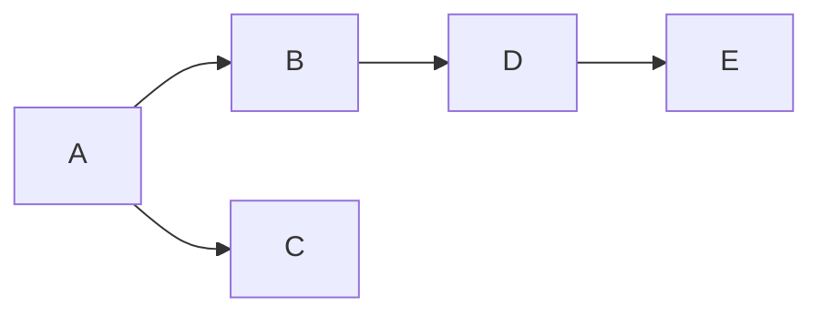
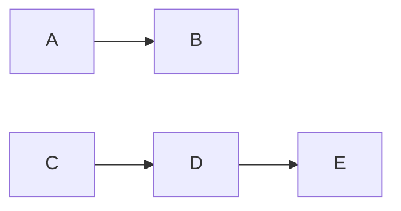

## Grafos Conexos ou desconexos
Implementar um algoritmo para descobrir se um grafo é ou não conexo.

# Exemplo Grafo conexo utilizado no código:

```
addEdge(graph, 0, 1);
addEdge(graph, 0, 2);
addEdge(graph, 1, 3);
addEdge(graph, 3, 4);
```



# Exemplo Grafo desconexo utilizado no código:

```
addEdge(graph, 0, 1);
addEdge(graph, 2, 3);
addEdge(graph, 3, 4);
```

